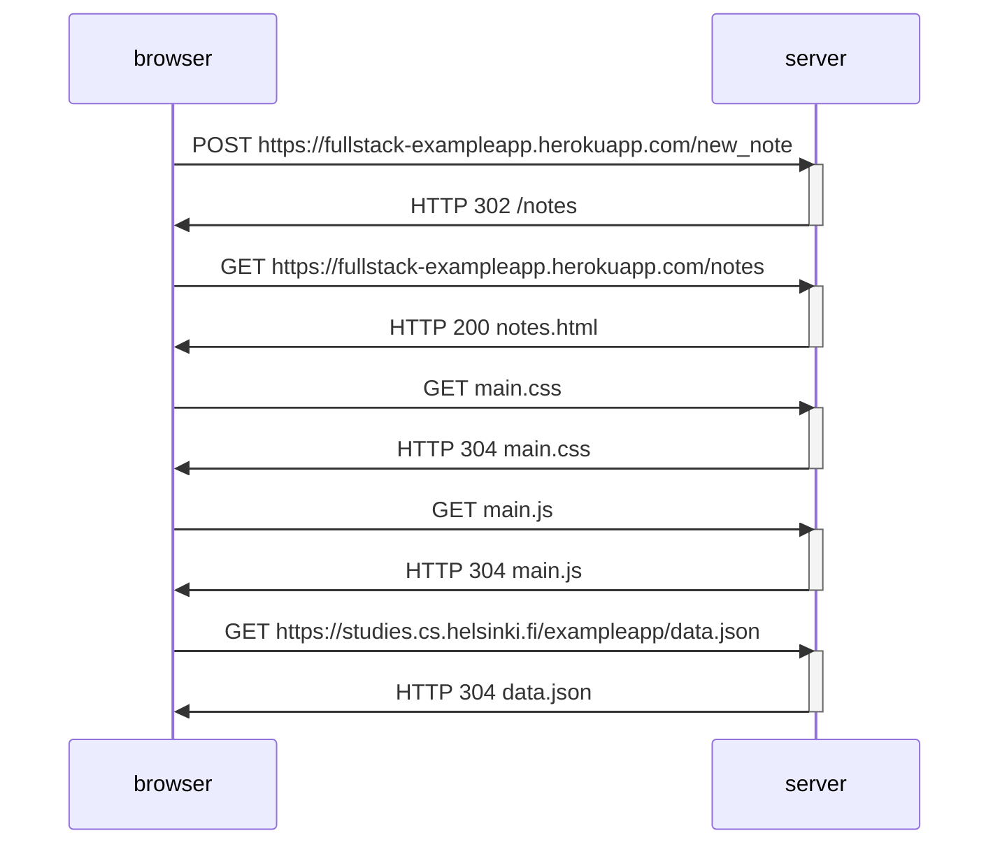

# Exercise 04 
## New note diagram

[https://fullstackopen.com/en/part0/fundamentals_of_web_apps#exercises-0-1-0-6](https://fullstackopen.com/en/part0/fundamentals_of_web_apps#exercises-0-1-0-6)

```mermaid
   sequenceDiagram
    participant browser
    participant server 

    browser->>server: POST https://fullstack-exampleapp.herokuapp.com/new_note
    activate server
    server->>browser: HTTP 302 /notes
    deactivate server

    browser->>server: GET https://fullstack-exampleapp.herokuapp.com/notes
    activate server
    server->>browser: HTTP 200 notes.html
    deactivate server

    browser->>server: GET main.css
    activate server
    server->>browser: HTTP 304 main.css
    deactivate server

    browser->>server: GET main.js
    activate server
    server->>browser: HTTP 304 main.js    
    deactivate server

    browser->>server: GET https://studies.cs.helsinki.fi/exampleapp/data.json
    activate server
    server->>browser: HTTP 304 data.json
    deactivate server
```