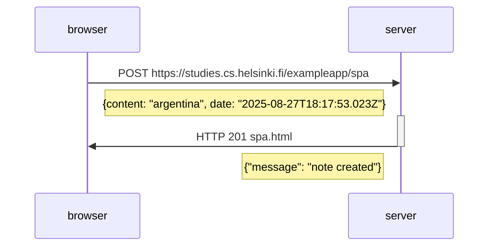

# Exercise 06 
## New note in Single page app diagram

[https://fullstackopen.com/en/part0/fundamentals_of_web_apps#exercises-0-1-0-6](https://fullstackopen.com/en/part0/fundamentals_of_web_apps#exercises-0-1-0-6)

